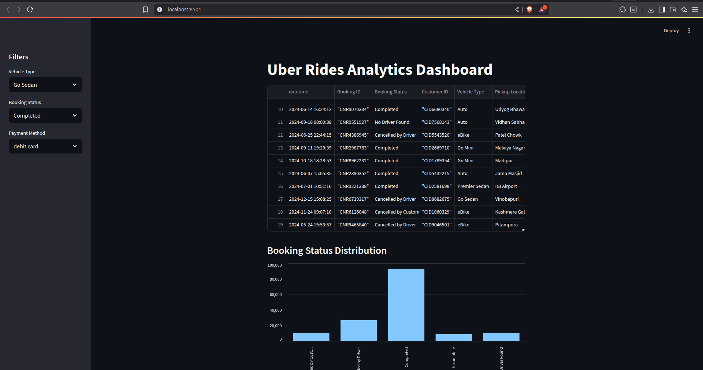
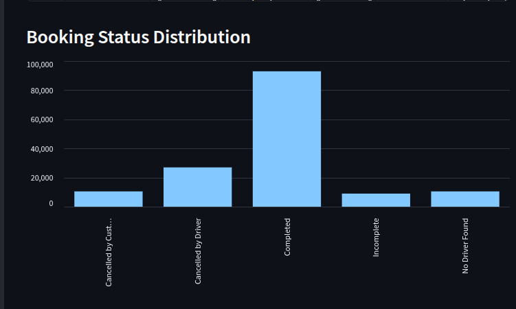
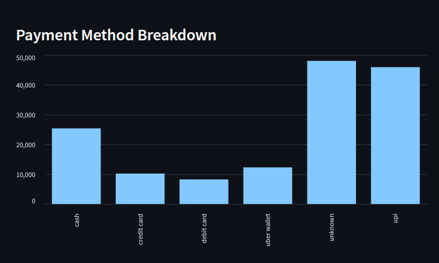
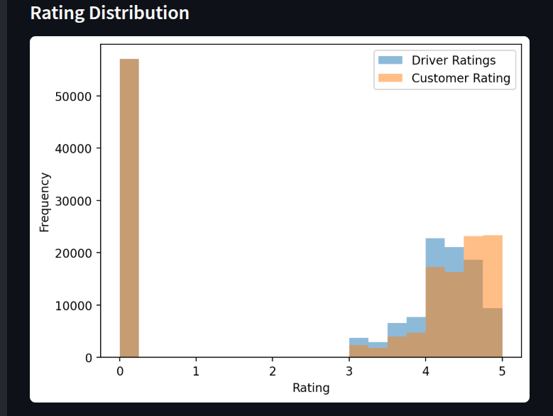
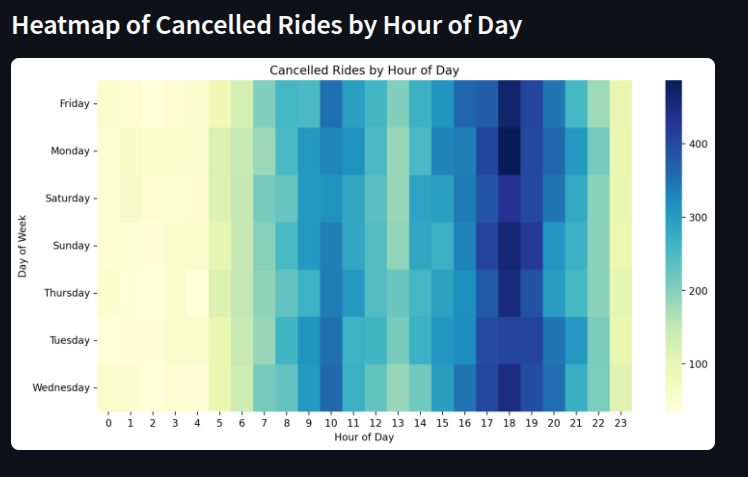
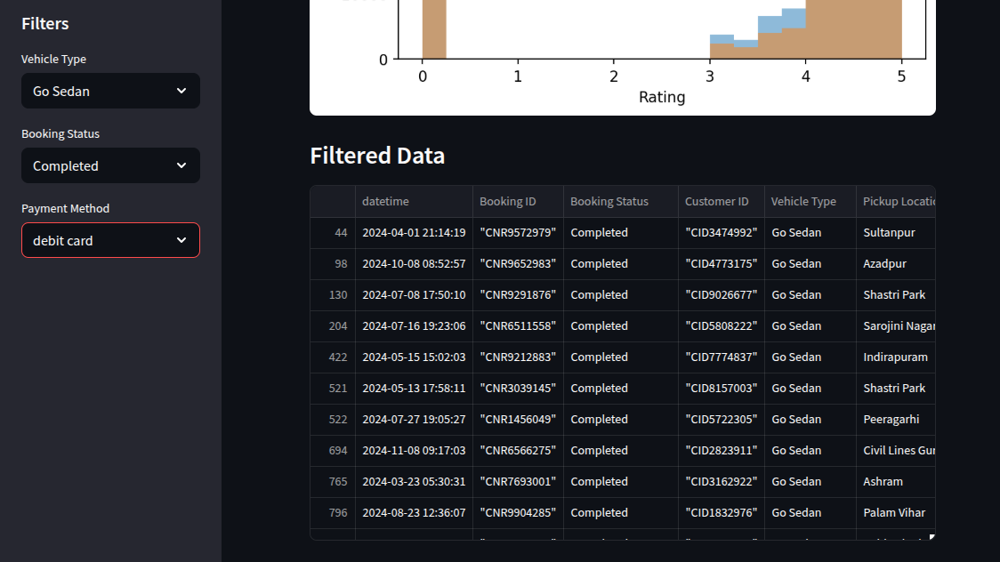

# NCR Ride Bookings Analytics Project

## Overview

This project provides comprehensive analytics for ride-sharing data in the National Capital Region (NCR). The system includes data exploration capabilities and an interactive dashboard for business intelligence and operational insights.

## Project Structure

```
ride-analytics/
├── explore.ipynb              # Data exploration and analysis notebook
├── uber_dashboard.py          # Streamlit dashboard application
├── ncr_ride_bookings.csv     # Raw dataset (150,000 records)
└── README.md                 # This documentation
```

## Dataset Description

The dataset contains **150,000 ride booking records** with the following key attributes:

### Core Fields
- **Date & Time**: Booking timestamp information
- **Booking ID**: Unique identifier for each ride request
- **Customer ID**: Unique customer identifier
- **Booking Status**: Ride completion status (Completed, Cancelled by Driver, Cancelled by Customer, No Driver Found, Incomplete)

### Operational Metrics
- **Avg VTAT**: Average Vehicle Turnaround Time
- **Avg CTAT**: Average Customer Turnaround Time
- **Booking Value**: Ride fare amount
- **Ride Distance**: Distance traveled in km
- **Driver Ratings**: Rating given to driver (1-5 scale)
- **Customer Rating**: Rating given by customer (1-5 scale)

### Location & Service Details
- **Pickup Location**: Starting point of the ride
- **Drop Location**: Destination point
- **Vehicle Type**: Service category (Auto, Bike, eBike, Go Sedan, Premier Sedan)
- **Payment Method**: Payment option used (UPI, Cash, Credit Card, Debit Card, Uber Wallet)

### Cancellation Analysis
- **Cancelled Rides by Customer**: Customer cancellation indicator
- **Reason for cancelling by Customer**: Customer cancellation reasons
- **Cancelled Rides by Driver**: Driver cancellation indicator
- **Driver Cancellation Reason**: Driver cancellation reasons
- **Incomplete Rides**: Incomplete ride indicator
- **Incomplete Rides Reason**: Reasons for ride incompletion

## Key Findings

### Booking Status Distribution
- **Completed Rides**: 62% (93,000 rides)
- **Driver Cancellations**: 18% (27,000 rides)
- **No Driver Found**: 7% (10,500 rides)
- **Customer Cancellations**: 7% (10,500 rides)
- **Incomplete Rides**: 6% (9,000 rides)

### Financial Metrics
- **Average Booking Value**: ₹508.18 for completed rides
- **Revenue Range**: ₹50 - ₹4,277 per ride
- **Median Booking Value**: ₹414

### Customer Experience
- **Average Customer Rating**: 4.40/5.0
- **Average Driver Rating**: 4.23/5.0
- **Rating Range**: 3.0 - 5.0 for both metrics

### Payment Preferences
- **UPI**: 45.0% (most popular)
- **Cash**: 24.9%
- **Uber Wallet**: 12.0%
- **Credit Card**: 10.0%
- **Debit Card**: 8.1%

### Top Cancellation Reasons

**Customer Cancellations:**
1. Wrong Address (22.5%)
2. Change of plans (22.4%)
3. Driver not moving towards pickup (22.2%)
4. Driver asked to cancel (21.9%)
5. AC not working (11.0%)

**Driver Cancellations:**
1. Customer related issues (25.3%)
2. Customer was coughing/sick (25.0%)
3. Personal & car related issues (24.9%)
4. More than permitted people (24.8%)

## Technology Stack

### Data Processing
- **Python 3.x**: Core programming language
- **Pandas**: Data manipulation and analysis
- **NumPy**: Numerical computations

### Visualization & Dashboard
- **Streamlit**: Interactive web dashboard framework
- **Matplotlib**: Statistical plotting
- **Seaborn**: Advanced statistical visualizations

### Data Storage
- **MinIO**: S3-compatible object storage for processed data
- **Parquet**: Optimized columnar data format

### Development Environment
- **Jupyter Notebooks**: Data exploration and prototyping

## Installation & Setup

### Prerequisites
```bash
pip install pandas streamlit matplotlib seaborn jupyter
```

### Running the Dashboard
```bash
streamlit run uber_dashboard.py
```

### Data Storage Configuration
The dashboard connects to MinIO object storage:
- **Endpoint**: http://localhost:9000
- **Bucket**: uber-datalake
- **File**: cleaned_ncr_ride_bookings.parquet

## Dashboard Features

### Interactive Visualizations


*Main dashboard showing KPIs and key metrics*

1. **Booking Status Distribution**: Bar chart showing ride completion rates
   

2. **Daily Revenue Trends**: Time series analysis of revenue patterns
   

3. **Payment Method Breakdown**: Distribution of payment preferences
   

4. **Rating Analysis**: Histogram comparing driver vs customer ratings
   

5. **Cancellation Heatmap**: Hour-by-hour cancellation patterns by day of week
   

### Key Performance Indicators (KPIs)

- Total rides processed: 150,000
- Completed ride count: 93,000
- Total revenue generated: ₹51,854,000
- Average driver rating: 4.23/5.0
- Average customer rating: 4.40/5.0

### Interactive Filters

- **Vehicle Type**: Filter by service category
- **Booking Status**: Filter by completion status
- **Payment Method**: Filter by payment option

### Data Exploration View

*Filterable data table showing ride details*

## Data Quality Notes

### Missing Data Analysis
- **Avg VTAT**: 7% missing (10,500 records)
- **Avg CTAT**: 32% missing (48,000 records)
- **Booking Value**: 32% missing (48,000 records)
- **Driver/Customer Ratings**: 38% missing (57,000 records)

Missing data is primarily associated with:
- Cancelled rides (no completion metrics)
- No driver found scenarios
- Incomplete bookings

### Data Validation
- All booking IDs are unique
- Date range spans 2024 data
- Ratings are within valid range (3.0-5.0)
- Booking values are positive

## Business Insights

### Operational Efficiency
- **68% Success Rate**: Combined completed + incomplete rides
- **Average Trip Distance**: 24.6 km
- **Peak Cancellation Factors**: Address issues and driver behavior

### Revenue Optimization Opportunities
1. **Reduce Customer Cancellations**: Address wrong address issues through better location services
2. **Driver Retention**: Focus on personal/car-related issues causing driver cancellations
3. **Service Quality**: Maintain high rating standards (both metrics above 4.2/5.0)

### Customer Experience
- Strong customer satisfaction (4.4/5.0 rating)
- UPI dominance suggests digital payment preference
- AC-related cancellations indicate service quality importance

## Future Enhancements

### Technical Improvements
1. **Real-time Data Pipeline**: Implement streaming data ingestion
2. **Advanced Analytics**: Add predictive models for cancellation prevention
3. **Geographical Analysis**: Include location-based insights and mapping
4. **Performance Optimization**: Implement data caching and query optimization

### Dashboard Enhancements
1. **Date Range Filtering**: Allow custom time period selection
2. **Drill-down Capabilities**: Enable detailed analysis of specific metrics
3. **Export Functionality**: Add data download options
4. **Mobile Responsiveness**: Optimize for mobile viewing
5. **Automated Alerting**: Set up KPI threshold monitoring

### Business Intelligence
1. **Predictive Analytics**: Forecast demand and cancellation risks
2. **Driver Performance Analytics**: Individual driver scorecards
3. **Route Optimization**: Analyze pickup/drop location patterns
4. **Seasonal Analysis**: Identify temporal trends and patterns

## Contact & Support

For questions, improvements, or collaboration opportunities:
- **Data Team**: Contact for technical inquiries
- **Business Intelligence**: For analytics and insights requests
- **Development**: For feature requests and enhancements

## License

This project is for analytical and educational purposes. Data usage should comply with applicable privacy and data protection regulations.

---

*Last Updated: September 2025*
*Version: 1.0*